# Outreach Referral Management System

## UX
___

## Project Goals
This is my fourth Milestone Project and will be based around a real world need. The goal of this project is to build a Referral Management System for the Outreach department of a local college. The RMS will help the college grow its existing Outrach department by efficiently tracking local schools the college works with, events at those schools and the referrals gained from each event. These referrals will then be tracked by the RMS as they progress to become students and eventually alumni, this conversion information and other Key Performance Indicators will be accessible via the Dashboard page. 

## Developer and Business Goals
To create a custom built DBMS that will allow users to track referrals thoughout their lifecycle in one place. The current system is multiple spreadsheets for each section: events, schools, referrals, students, courses and classes. The main aim will be to increase department productivity by reducing admin time and providing analytical insights via the dashboard such as:
- Number of referrals made at an event and conversion rates
- How many referrals were made by each staff member at an event and conversion rates
- Upcoming events and assigned staff
- Upcoming classes
- Which courses are in demand
- Which courses aren't getting interest
- Courses that have enough interest to run a class

## User Stories

ID | User Story | Included in MVP |
:---: | --- | :---:
1 | As a first time user I want to be able to navigate the site with ease | Yes
2 | As a user I want to be able to add a new referral and edit it if I make mistakes  | Yes
3 | As a user I want to be able to add a new school we are working with and edit it if I make mistakes | Yes
4 | As a user I want to be able to add a new event and edit it if I make mistakes  | Yes
5 | As a user I want to be able to add a new course and edit it if I make mistakes  | Yes
6 | As a user I want to be able to add a new class and edit it if I make mistakes  | Yes
7 | As a user I want to convert a prospective referral to a student with information about the course they are on | Yes
8 | As a user I want to be able to see details about the school, event, referral or student I am looking for including contact info | Yes
9 | As a user I want to be able to see details about the course or class I am looking for including course dates, students in the class and the class tutor | Yes
10 | As a user I want to be able to change an active referral to being 'no longer interested'| Yes
11 | As a user I want to be able to change an active student to being an 'alumni' or a 'progression'| Yes
11 | As a user I want to be able to send out initial, mid course and end of course self assessments to students | No
12 | As a user I want to easily be able to resend assessments to students as a reminder | No
13 | As a user I want to be able to see how many referrals I have made | Yes
14 | As a user I want to be able to search for what I am looking for | Yes
15 | As a manager I want to be able to delete duplicate or incorrect referrals, schools, events, courses and classes. | Yes
16 | As a manager I don't want staff to be able to delete any data, only to be able to update or add new data | Yes
17 | As a manager I don't want anyone to be able to delete an active student | Yes
18 | As a manager I want to see how many referrals staff members have made, how many of these became students and figures for course progressions | Yes


## Design Choices
___
When thinking about the design of the app I wanted to make the layout as intuitive as possible. To achieve this I will be using [Font Awesome](https://fontawesome.com/) icons where appropriate in combination with the [Google Fonts]() family [Roboto]()

### Navigation

As some of the web app features such as adding a new referral, school, class etc. will be done repeatedly I wanted to make sure it was easy to navigate to the required pages from anywhere on the app. To accomplish this I have used a combination of the following:
   - 'Quick links' on the cards on the home page allow the user to quickly navigate to the required form for the task they wish to complete.
   - On the main page for each app I have used a button at the top of the page to allow the user to navigate to that pages relevant add item form. 
   - Where an item references Foreign Key this will be displayed as a link to the original item. For example where an event references a school on it's `event details` page, the school name will be a clickable link to that schools details page.
   - In addition to links to all pages being available on the landing page these links will also be included in the collapsable navbar to allow the user to navigate between areas of the app with ease.
   - On the tables used to display the lists of items from the database I havve included a 'Quick Actions' column that contains `edit` and `delete` buttons allowing the user to update or remove information without having to go to the items details page. (The delete button is setup to only be visible to Managers/Senior Staff) This removes the extra step or 'click' in getting the user where they want to go to fall inline with the UI rule of not needing to make more than two clicks to where you want to go.
   - If a user is viewing the details of an item and they notice an error they will be able to edit this (or delete if manager) without having to navigate away from the page by using the `edit` and `delete` buttons on the details page.

### Color Scheme

To ensure acessibility I used the [Material.io](https://material.io/) colour tool in combination with the Webaim Contrast Checker. My colour scheme can be seen [here](https://material.io/resources/color/#!/?view.left=1&view.right=1&primary.color=006152&secondary.color=f4f4f4) and the contrast checks for the [Primary colour](https://webaim.org/resources/contrastchecker/?fcolor=FFFFFF&bcolor=006152) and [Primary Dark colour](https://webaim.org/resources/contrastchecker/?fcolor=FFFFFF&bcolor=00362A)

### Database Schema

To put together the relational database schema from this project I used [Lucidchart]() to help me map out my tables and work out the relationship types between the tables.

A copy of my original database schema can be seen below
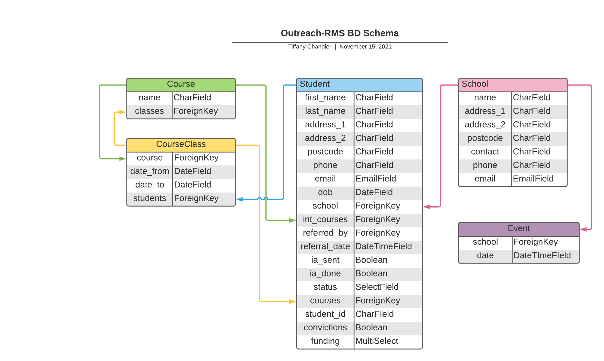

## Wireframes
___
- Home
  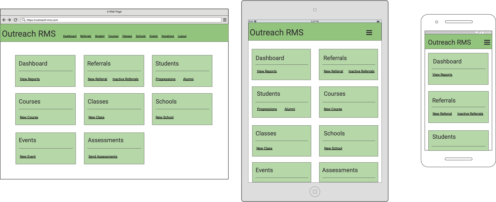

- Dashboard
  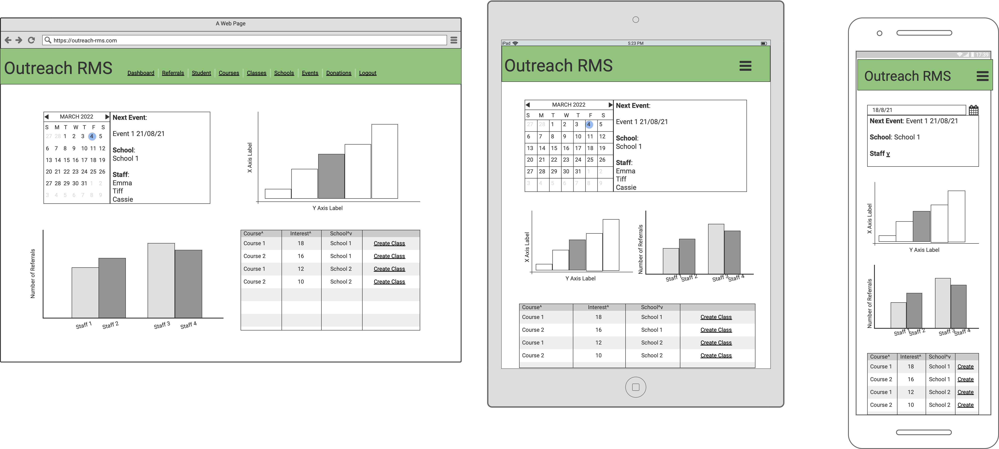

- Referrals
  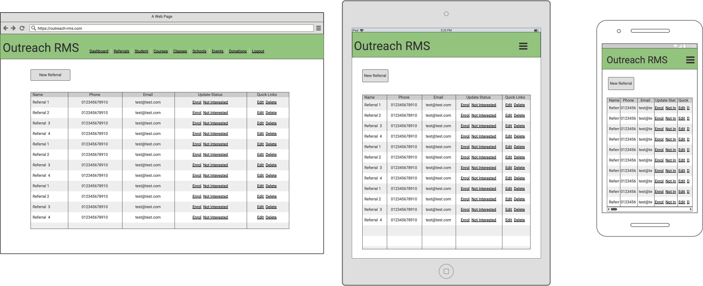

- New Referral
  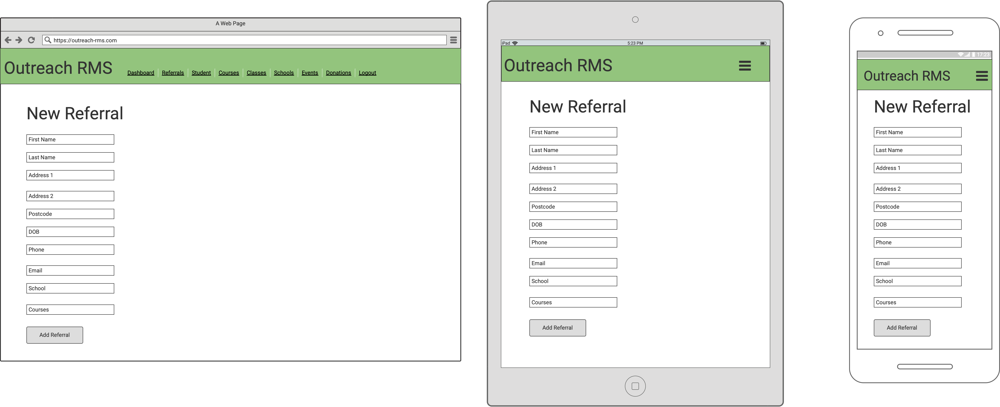

- Students
  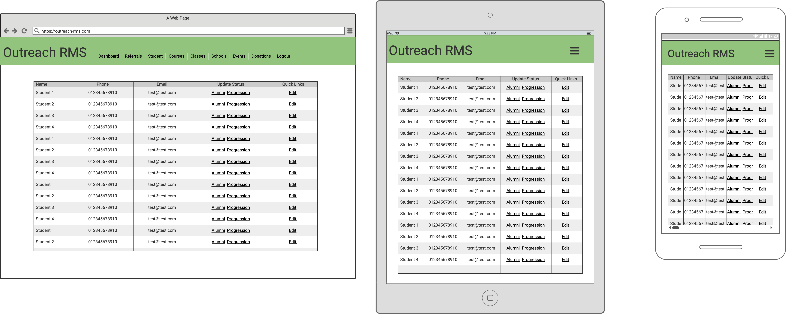

- Courses
  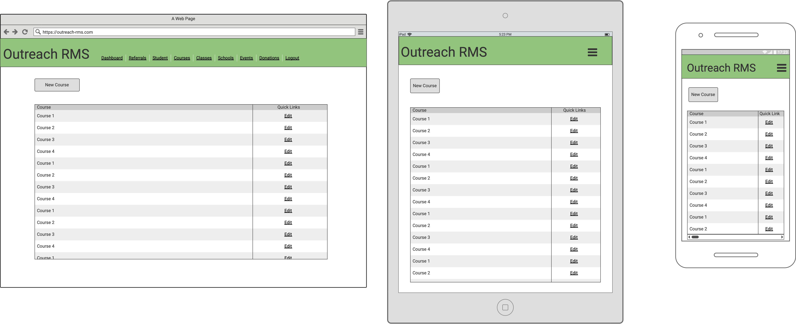

- Schools
  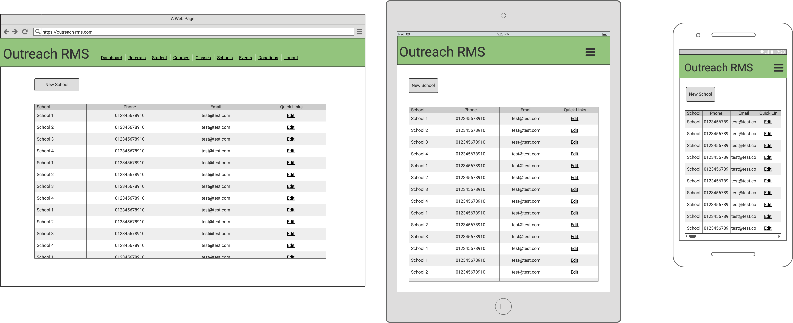

- New School
  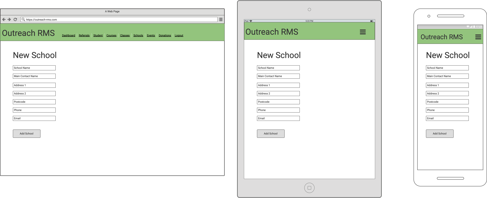

- Events
  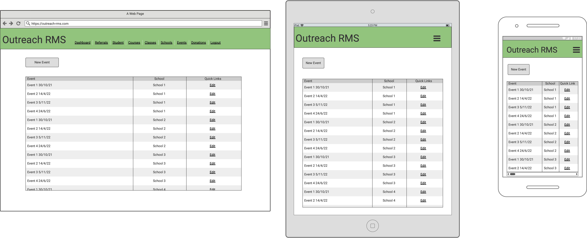


## Features
___
### Existing Features


### Features to Implement


## Technologies used


## Testing
___
To avoid making this README too long I have created a seperate file to document my testing during the creation of the project. 

## Deployment
___
This project has been deployed via [Heroku](https://www.heroku.com/). To prepare the app for deployment I created a `requirements.txt` file and a `Procfile`. I did this using the following commands in the terminal:

```
pip3 freeze --local > requirements.txt
```
```
echo web: gunicorn outreach_rms.wsgi > Procfile
```

When deploying the app on Heroku I used the GitHub deployment method and put the key, value pairs from the `env.py` in settings > config vars e.g `DEBUG` as the key and `False` as the value.

Once this info had been input into Heroku and the `requirements.txt` file and the `Procfile` have been pushed to GitHub, I then went to deploy > enable automatic deployments and then selected 'deploy branch'.This method of deployment allows the app to update whenever new code is pushed to the GitHub repository.

## Issues During Deployment

Issue | Soloution | Screen Shots
---- | ---- | ---
[Static files not being collected](https://github.com/Tiff-C/outreach-rms/issues/5)|  Originally I tried to fix the issue by adding `STATICFILES_DIRS = (os.path.join(BASE_DIR, 'static'),) STATIC_ROOT = os.path.join(BASE_DIR, 'staticfiles')` to my [settings.py](outreach_rms/settings.py) file as suggested in [Django and Static Assets - Heroku Documentation](https://devcenter.heroku.com/articles/django-assets). Unfortunatley this did not work and I was now getting a MIME type error. To resolve this I tried updating the mimetype using the answer provided Fergal Moran in this [Stack Overflow Post](https://stackoverflow.com/a/16355034). I also tried installing Whitenoise as suggested in [Django and Static Assets - Heroku Documentation](https://devcenter.heroku.com/articles/django-assets) This resolved the issue and the static CSS files were now being loaded. | 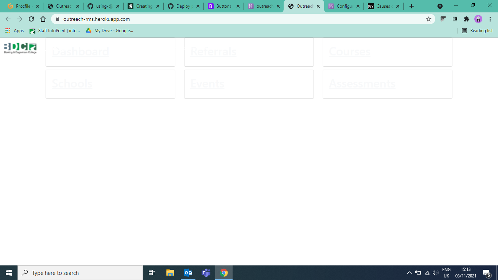 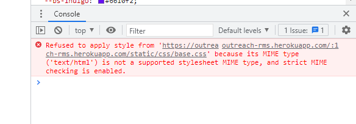 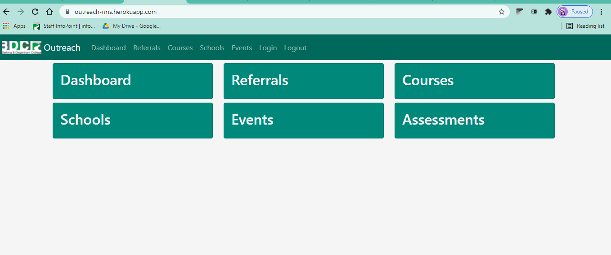
[Django template parsing error](https://github.com/Tiff-C/outreach-rms/issues/6) | When testing the links in the navbar on the deployed project I was getting a `ProgrammingError`, I was not getting the eroor when running the project locally. Resolved issue by running `heroku run python manage.py migrate -a outreach-rms` in CLI, however schools & events added during local development have not been migrated across. Resolved by removing sqlite3 from database backends and replacing with postgress db backend in settings.py using [dj-database-url](https://pypi.org/project/dj-database-url/) as seen in this [commit](https://github.com/Tiff-C/outreach-rms/commit/f9c5f25b834710cac96ffbc358aaa2d2f40b3142). | 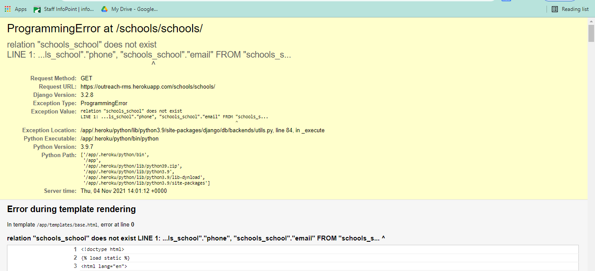 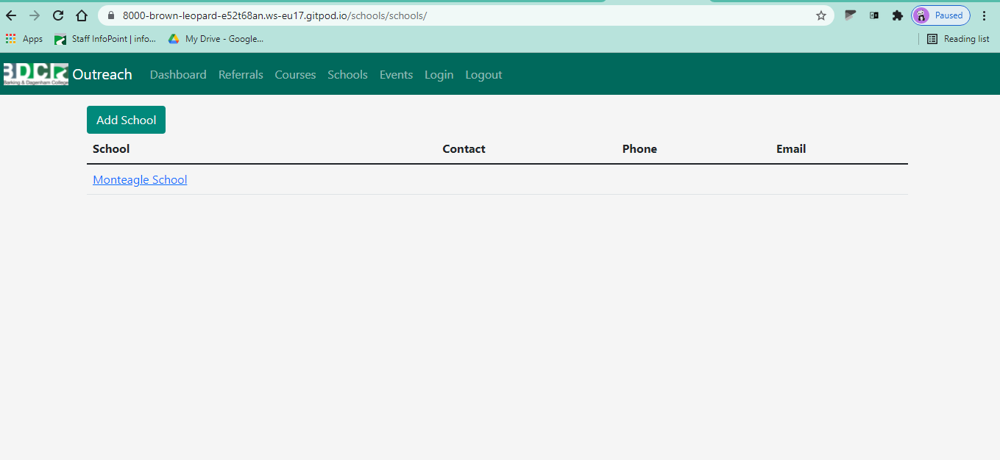 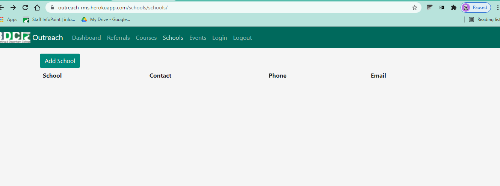

I had no other issues during the deployment of my project.

## How to run This Project Locally

### Local Deployment

   To make a local copy of this project, you can clone it by typing the following in your IDE terminal:

   - `git clone https://github.com/Tiff-C/outreach-rms.git`

   Alternatively, if using Gitpod, you can click below to create your own workspace using this repository.

   [](https://gitpod.io/#https://github.com/Tiff-C/outreach-rms)

When running this project locally you will need to setup an env.py file, an example of this file can be seen below. Once you have this setup run `python manage.py runserver` to run the project locally.

      
#### The `env.py` file
   As the env.py file contains sensitive information please ensure it is not pushed to a public repository.

   ```py
   """ import os to set env defaults """
   import os

   os.environ.setdefault("SECRET_KEY", "<SECRET_KEY_HERE>")
   os.environ.setdefault("DEBUG", "FALSE")
   os.environ.setdefault("DATABASE_URL", "<DB_URL_HERE>")
   os.environ.setdefault("STRIPE_PUBLISHABLE", "<PUBLISHABLE_API_KEY>")
   os.environ.setdefault("STRIPE_SECRET", "<SECRET_API_KEY>")
   ```
