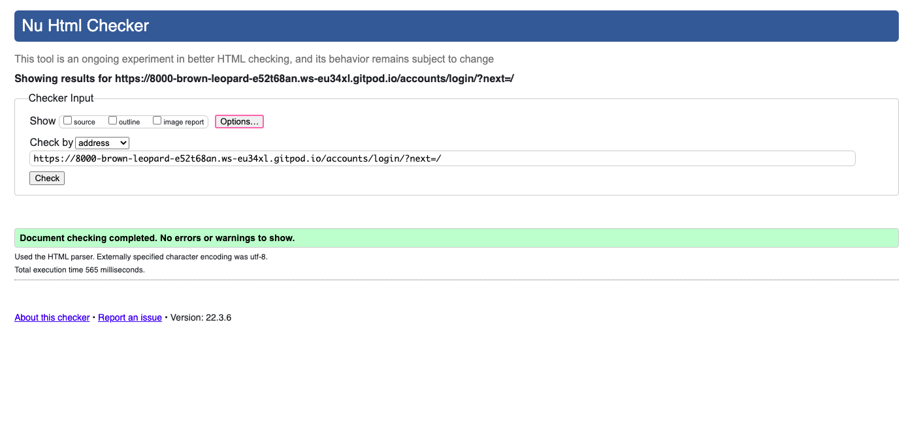
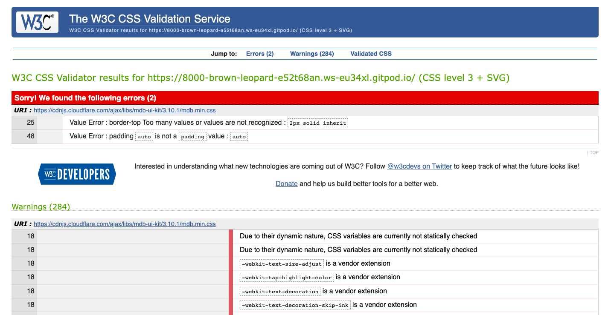

# Project Testing

Return to [README](README.md)

In line with coding best practice I have tested throughout the development of my project and tracked this file contains details of the testing carried out and any relevant screen shots. To track any bugs found during development I use GitHub Issues, I like to use Issues as I feel it is good practice for working in a team and helps to keep me organised while I work. I have also used commit messages to document minor bugs that were easily fixed and do not worth mentioning below.

---
## Project Setup

During the setup of my project I tested each step by running the project locally using 'python3 manage.py runserver' in the CLI. Below is a table summarising the testing carried out during the setup of the project. 

Feature | Test | Result
--- | --- | ---
Project Start / Admin | After checking there are no error messages I tested the admin page had been setup correctly by adding `\admin` to the end of the browser URL. | No issues
Allauth | To test Allauth had been setup correctly I first verified the superuser email address via the admin page, returned to the landing page and then added `\accounts` to the end of the browser URL and logged in using the superuser credentials. | No issues
Home app | To test my templates, views and urls were working for the home app I added `<h1>Test</h1>` to [index.html](home/templates/home/index.html) (seen in this [commit](https://github.com/Tiff-C/outreach-rms/commit/bb2877e72390fbc3321cad2bfe5d615c3a5e7da0) and checked this displayed when running the project locally. | No issues
Navigation | To test the navigation was functioning as expected I used [Chrome DevTools](https://developer.chrome.com/docs/devtools/) in the browser and tested the nav collapsed at the correct breakpoints, checked the burger icon displayed the collapsed nav when clicked. I added links to the navbar as they were created throughout the project, I tested each of these worked as they were added. | [Template parsing error](https://github.com/Tiff-C/outreach-rms/issues/6) and [Navbar toggler not working](https://github.com/Tiff-C/outreach-rms/issues/18). No other issues
Models | To check each of my models were functioning correctly after making initial migrations I went to the `admin` page and added a couple of items to each model to test they were functioning as expected. Once I had set up forms and their views I used the forms to test any updates to the models were functioning as expected. | [Date formats not displaying correctly](https://github.com/Tiff-C/outreach-rms/issues/7) and [Courses displaying 'coursess'](https://github.com/Tiff-C/outreach-rms/issues/8). No other issues.
URLs & Views | When adding URL paths and Views to the project I checked these worked on both the deployed project and the locally run project. | [URL paths displaying app name twice](https://github.com/Tiff-C/outreach-rms/issues/10) , [Broken URL paths on add_referal view form submission](https://github.com/Tiff-C/outreach-rms/issues/15), [Broken URL on event details](https://github.com/Tiff-C/outreach-rms/commit/befaf25f9557d90114362482551561b9c86ec98f) and [Broken URL path on edit courses path](https://github.com/Tiff-C/outreach-rms/issues/16). No other issues.
Forms | To test my forms were working correctly I tested them on both the deployed site and locally. This can be seen in the commit messages for [Schools](https://github.com/Tiff-C/outreach-rms/commit/22ac4f3be95a6158c2b39abeb364d0bacd1ef6cd), [Events](https://github.com/Tiff-C/outreach-rms/commit/802d5d2bf100713e920b5df5e52fc3a8d432204d), [Courses](https://github.com/Tiff-C/outreach-rms/commit/2c549fe100c033772ed7763357f80dd6b4ce8f76) and [Students](https://github.com/Tiff-C/outreach-rms/commit/a16aa76f5e1c3f6767eb8463ca3821f8381f7056) | [Error 404 on form submit](https://github.com/Tiff-C/outreach-rms/commit/ce2e6a3d7a5aec537894a5a7d68980dea3afd622) and [Referral form not capturing User](https://github.com/Tiff-C/outreach-rms/issues/11). No other issues.
Delete Conf Modal | To test the delete confirmation modals were working correctly I tested them on both the deployed project and locally. | [Delete modals not showing](https://github.com/Tiff-C/outreach-rms/issues/19). No other Issues.
Stripe | To test stripe I have used a mixture of print/ console.log statements and manual testing. | [Issues setting up stripe]()

## Code validators

- To test the validity of my HTML I have used [W3schools HTML Validator]():

- To test the validity of my CSS I have used [W3schools CSS Validator]():

- To ensure PEP8 compliance I have used the pylint filter in my development environment.